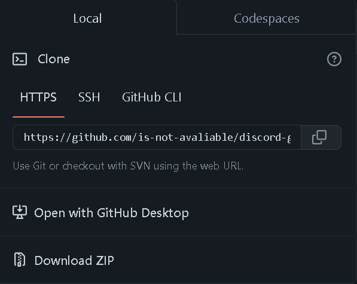
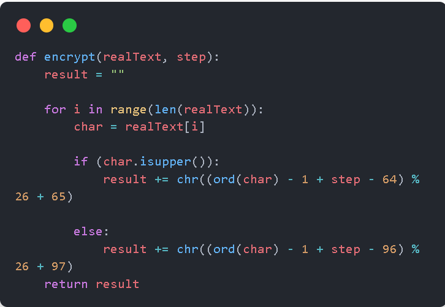
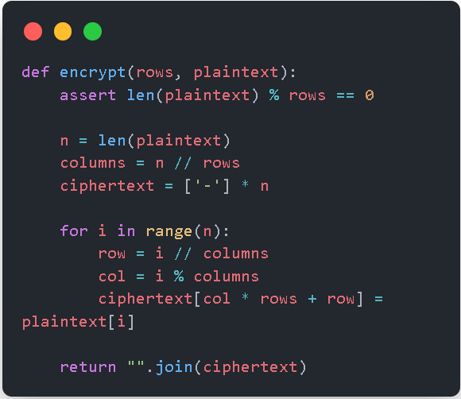
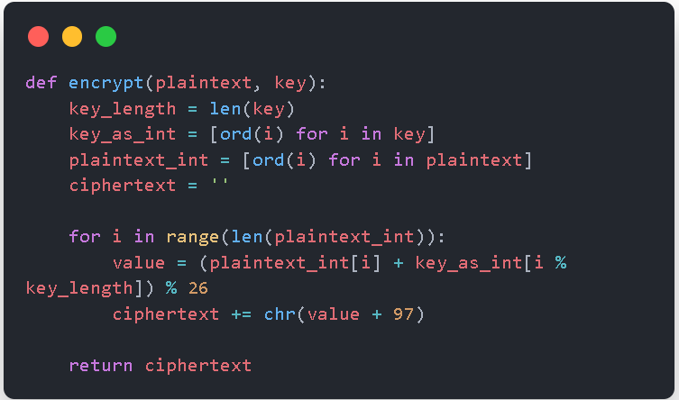
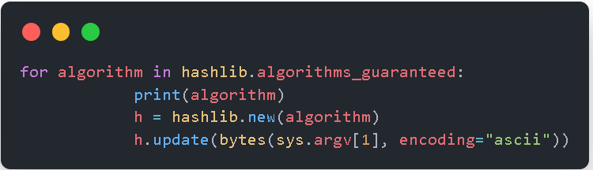
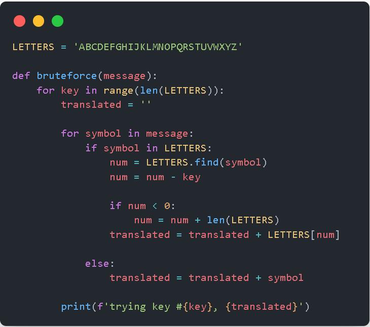
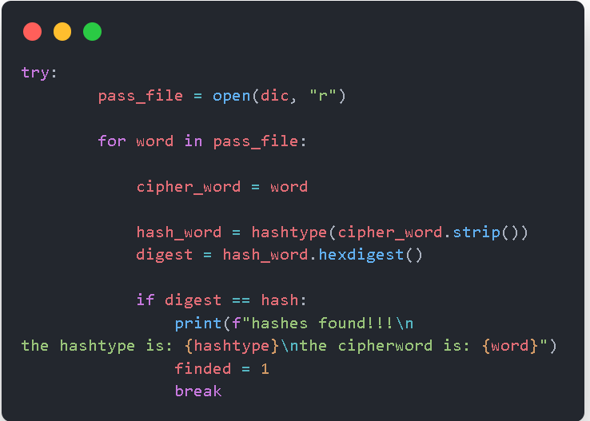

# cryptography-tools (En español XD)
you can find here some tools for cryptography

<hr>

## Instalacion

* Descargar o clonar el repositorio



or

```bash
git clone https://github.com/is-not-avaliable/cryptography-tools
```

* Moverse al directorio


```bash
cd cryptography-tools/
```

* instalar los requerimientos

```bash
user@host: cryptography-tools/$ pip3 install -r requirements
```

<hr>

## Criptografia clasica

* Metodo Cesar

*Creado en En criptografía, el cifrado César, también conocido como cifrado por desplazamiento, código de César o desplazamiento de César, es una de las técnicas de cifrado más simples y más usadas. Es un tipo de cifrado por sustitución en el que una letra en el texto original es reemplazada por otra letra que se encuentra un número fijo de posiciones más adelante en el alfabeto. Por ejemplo, con un desplazamiento de 3, la A sería sustituida por la D (situada 3 lugares a la derecha de la A), la B sería reemplazada por la E, etc. Este método debe su nombre a Julio César, que lo usaba para comunicarse con sus generales.* <a href="https://es.wikipedia.org/wiki/Cifrado_César" target="_blank">Wikipedia</a>




### input
```bash
python3 caesar.py [-E, -D] string numeralkey

# -E        Encrypt
# -D        Decrypt
```

### Example
```bash
python3 caesar.py -E hola 2
```

### output
```bash
jqnc
```

* Metodo de la Escítala

*Una escítala (en griego antiguo, σκυτάλη, skytálē) es un sistema de criptografía utilizado por los éforos espartanos para el envío de mensajes secretos. Está formada por dos varas de grosor variable (pero ambas de grosor similar) y una tira de cuero o papiro, a las que ambas se puede denominar escítala.*
<br>

*El sistema consistía en dos varas del mismo grosor que se entregaban a los participantes de la comunicación. Para enviar un mensaje se enrollaba una cinta de cuero de forma espiral a uno de los bastones y se escribía el mensaje longitudinalmente, de forma que en cada vuelta de cinta apareciese una letra de cada vez. Una vez escrito el mensaje, se desenrollaba la cinta y se enviaba al receptor, que sólo tenía que enrollarla a la vara gemela para leer el mensaje original.* <a href="https://es.wikipedia.org/wiki/Cifrado_César" target="_blank">Wikipedia</a>



### input
```bash
python3 scytale.py [-E, -D] string rows

# -E        Encrypt
# -D        Decrypt
```

### Example
```bash
python3 scytale.py -E hola 2
```

### output
```bash
hloa
```

* Metodo Vigénere

*El cifrado de Vigenère (no confundir con el cifrado de Vernam) es un cifrado basado en diferentes series de caracteres o letras del cifrado César formando estos caracteres una tabla, llamada tabla de Vigenère, que se usa como clave. El cifrado de Vigenère es un cifrado por sustitución simple polialfabético.*

*El cifrado de Vigenère se ha reinventado muchas veces. El método original fue descrito por Giovan Battista Belasso en su libro de 1553 La cifra del Sig. Giovan Battista Belasso. Sin embargo, fue incorrectamente atribuido más tarde a Blaise de Vigenère, concretamente en el siglo XIX, y por ello aún se le conoce como el "cifrado de Vigenère".*

*Este cifrado es conocido porque es fácil de entender e implementar, además parece irresoluble; esto le hizo valedor del apodo el código indescifrable (le chiffre indéchiffrable, en francés).* <a href="https://es.wikipedia.org/wiki/Cifrado_de_Vigénere" target="_blank">Wikipedia</a>



### input
```bash
python3 vigenere.py [-E, -D] mayus(string keyword)

# -E        Encrypt
# -D        Decrypt
```

### Example
```bash
python3 vigenere.py -E HOLA SOL
```

### output
```bash
zcws
```
<hr>

## Hash

*Una función resumen,1​2​ en inglés hash function,3​4​5​ también conocida con el híbrido función hash, convierte uno o varios elementos de entrada a una función en otro elemento. También se las conoce como función extracto, del inglés digest function, función de extractado y por el híbrido función digest.*

*Una función hash H es una función computable mediante un algoritmo tal que:*

*H : U → M {\displaystyle H:U\rightarrow M}*

*x → h ( x ) {\displaystyle x\rightarrow h(x)}*

*La función hash tiene como entrada un conjunto de elementos, que suelen ser cadenas, y los convierte en un rango de salida finito, normalmente cadenas de longitud fija. Es decir, la función actúa como una proyección del conjunto U sobre el conjunto M.*

*Hay que tener en cuenta que M puede ser un conjunto definido de enteros. En este caso, podemos considerar que la longitud es fija si el conjunto es un rango de números de enteros, ya que podemos considerar que la longitud fija es la del número con mayor cantidad de cifras. Cabe destacar que es posible convertir todos los números a una cantidad especifica de cifras simplemente anteponiendo ceros.*

*Normalmente el conjunto U tiene un número elevado de elementos y M es un conjunto de cadenas con un número acotado de símbolos. La idea básica de un valor hash es que sirva como una representación compacta de la cadena de la entrada. Por esta razón, se dice que estas funciones permiten resumir datos del conjunto dominio.* <a href="https://es.wikipedia.org/wiki/Función_hash" target="_blank">Wikipedia</a>



### input
```bash
python3 Hash.py <string>
```

### Example
```bash
python3 Hash.py "hola mundo"
```

### output
```
blake2s
67f08344e884cd4b0be50e592f0b91cf41d7555717fe06509ad740d138483d23
sha224
8309fa94f7b71b4d37e0a682fceb5c321c34f764eb83067f83f61949
blake2b
a7f66e229a2bcc6a4e6ec009c08994a958842e592883a30826f81135437719a0408a9f21ea252c3cee582cd05f254b5fb7e6c06db0fa0c8c9f2682051451a275
sha3_256
6f2a99cda22eeb252d0d1ac5c0bf6d43f33344f9442c66548abc1d3207533bf1
sha512
e361ecc31f2aac2066a3103d3b14dc63b5984b028f9f2d09dee67460ce2702bc81673acf58109b553324852c62a227d9a75d4c2f686580270fe143048f47c33c
sha3_512
32fd3c4c220b24991aa9930164c37a3d12496984f3add3c51faf931d8ebc2c7780a13e5e8cfb0a20243ed0703dacd5a1210c3c12faa6b7d5d1c70088df60430c
sha1
459567d3bde4418b7fe302ff9809c4b0befaf7dd
sha256
0b894166d3336435c800bea36ff21b29eaa801a52f584c006c49289a0dcf6e2f
shake_256
fae4e606dfea6ff4b73f46b3214ae73852f2f0cae6b8f4acafe3ea4e945237a1f5f9f728569d93eaaaac67ffae827bdf46d7b97d53b89e2f0d8c00fe9662671a5cd784b997dd20a9763cbf2ca248ba163845fafc26c420bb7c1b8880eca5e27e4acd1bcd4d27d586ab3a7bc9c46005082b9b50cd56d65862a968a9584f120497
sha3_224
b851d8bdff66f572c7a3d24a1779d795080a872658688ee63022f4f0
sha3_384
6e84f558fdb584c9c5df437da3bd377f9a5e3612ee3e7951a51429680d8ac57a466760b4e37735119e9f2462ef38b2bd
sha384
fc19e4e99a4da7476c35ef10d26a4d1909219908562d4819b671a6006c5190aec91ffc53a63c8240f1024a35c1827b0a
md5
0ad066a5d29f3f2a2a1c7c17dd082a79
shake_128
bb58a588b29bb90f6e361d87742e67a94a87acc1a1b011971abd5a0aee3eee79fb8515eb77320734708a5571e050f3245dfbabb24165e95af75191524311b93a58b7f593065f1f99cb52e578908b0b6a38f3b8132089e3d5c83aa20adc44ecabe40b1a865a02abc8583a3c7e5e0d993739ab68cdfdd2fdcee1de814b694b5399
```

* Hash files

### input
```bash
python3 HashFiles.py <path>
```

### Example
```bash
python3 HashFiles.py /home/test.txt
```

<hr>

## BruteForce

*En criptografía, se denomina ataque de fuerza bruta a la forma de recuperar una clave probando todas las combinaciones posibles hasta encontrar aquella que permite el acceso.​* <a href="https://es.wikipedia.org/wiki/Ataque_de_fuerza_bruta" target="_blank">Wikipedia</a>

* Metodo cesar



### input
```bash
python3 CaesarBF.py string
```

### Example
```bash
python3 CaesarBF.py jqnc
```

### output
```bash
trying key #0, JQNC
trying key #1, IPMB
trying key #2, HOLA
trying key #3, GNKZ
trying key #4, FMJY
trying key #5, ELIX
trying key #6, DKHW
trying key #7, CJGV
trying key #8, BIFU
trying key #9, AHET
trying key #10, ZGDS
trying key #11, YFCR
trying key #12, XEBQ
trying key #13, WDAP
trying key #14, VCZO
trying key #15, UBYN
trying key #16, TAXM
trying key #17, SZWL
trying key #18, RYVK
trying key #19, QXUJ
trying key #20, PWTI
trying key #21, OVSH
trying key #22, NURG
trying key #23, MTQF
trying key #24, LSPE
trying key #25, KROD
```

* Hash BruteForce

**IMPORTANTE USAR UN DICCIONARIO, SINO SERÁ IMPOSIBLE CRACKEAR EL HASH**



### input
```bash
python3 HashBF.py <hash> <dictionarie_path>
```

### Example
```bash
python3 HashBF.py 123456 mydictionarie.txt
```

### Output
```bash
hashes found!!!
the hashtype is: <built-in function openssl_md5>
the cipherword is: 123456
```
